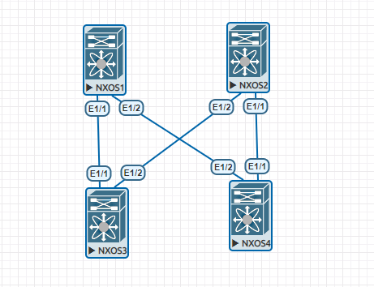

Домашнее задание №2.

Underlay. OSPF.

Цель: Настроить OSPF для Underlay сети.

Схема.

**1. Config sp1:**

feature ospf

interface loopback0

  ip address 10.0.1.1/32

router  ospf UNDERLEY
  router 10.0.1.1

interface Ethernet1/1

  no switchport

  mtu 9216

  medium p2p

  ip address 10.0.3.0/31

  ip router ospf UNDERLEY area 0.0.0.0

  no shutdown

interface Ethernet1/2

  no switchport

  mtu 9216

  medium p2p

  ip address 10.0.3.2/31

  ip router ospf UNDERLEY area 0.0.0.0

  no shutdown
 
**2. Config sp2:**

feature ospf

interface loopback 0

  ip address 10.0.2.0/32

router ospf UNDERLEY

  router 10.0.2.0

interface Ethernet1/1

  no switchport

  mtu 9216

  medium p2p

  ip address 10.0.3.8/31

  ip router ospf UNDERLEY area 0.0.0.0

  no shutdown

interface Ethernet1/2
  
  no switchport

  mtu 9216

  medium p2p

  ip address 10.0.3.10/31

  ip router ospf UNDERLEY area 0.0.0.0

  no shutdown

**3. Config lif1:**

feature ospf

interface loopback 0

ip addres 10.0.4.1/32

router ospf UNDERLEY

  router 10.0.4.1

interface Ethernet1/1

  no switchport

  mtu 9216

  medium p2p

  ip address 10.0.3.1/31

  ip router ospf UNDERLEY area 0.0.0.0

  no shutdown

interface Ethernet1/2

  no switchport

  mtu 9216

  medium p2p

  ip address 10.0.3.11/31

  ip router ospf UNDERLEY area 0.0.0.0

  no shutdown

**4. Config lif2:**

feature ospf

interface loopback 0
 
 ip address 10.0.5.1/32

router ospf UNDERLEY
  
  router 10.0.5.1

interface Ethernet1/1
  
  no switchport
  
  mtu 9216
  
  medium p2p
  
  ip address 10.0.3.9/31
  
  ip router ospf UNDERLEY area 0.0.0.0
  
  no shutdown

interface Ethernet1/2
  
  no switchport
  
  mtu 9216
  
  medium p2p
  
  ip address 10.0.3.3/31
  
  ip router ospf UNDERLEY area 0.0.0.0
  
  no shutdown

