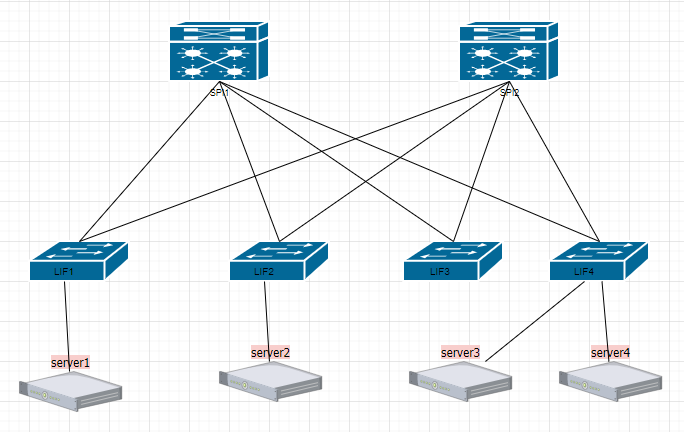

Домашнее задание №1.
Проектирование адресного пространства.
Цель:

    Собрать схему CLOS;
    Распределить адресное пространство.

Решение.
1. Топология сети CLOS.

2. Адресаное пространство

    2.1. IP 10.Dn.Sn.X/31:
    	Dn-номер Локации.
	    Sn-номер spine
	    X-номер по порядку
    2.2. Dn-для локации 1 = 0-7

    2.3. SP1
        10.0.1.1/32 loopbak0
        10.0.3.0/31 point&point LIF1
        10.0.3.2/31 point&point LIF2
        10.0.3.4/31 point&point LIF3
        10.0.3.6/31 point&point LIF3

    2.4. SP2
        10.0.2.0/32 loopbak0
        10.0.3.8/31 point&point LIF1
        10.0.3.10/31 point&point LIF2
        10.0.3.12/31 point&point LIF3
        10.0.3.14/31 point&point LIF3

    2.5. LIF1
        10.0.4.1/32 loopbak0
        10.0.3.1/31 point&point SP1
        10.0.3.8/31 point&point SP2

    2.6. LIF2
        10.0.5.1/32 loopbak0
        10.0.3.3/31 point&point SP1
        10.0.3.11/31 point&point SP2

    2.7 LIF3
        10.0.6.1/32 loopbak0
        10.0.3.5/31 point&point SP1
        10.0.3.13/31 point&point SP2

    2.8 LIF4
        10.0.7.1/32 loopbak0
        10.0.3.7/31 point&point SP1
        10.0.3.15/31 point&point SP2

1.6 and of servis
10.1.0.0/16
